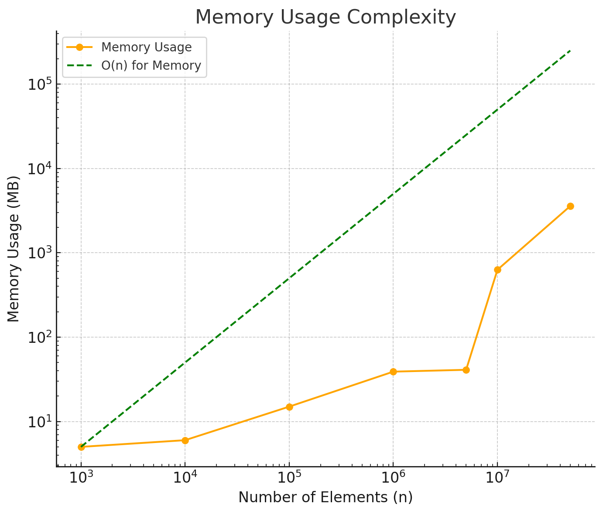

# Operation Tree Profiling

## Overview

This project focuses on the implementation and profiling of a Balanced Binary Search Tree (BBST). The main objectives
are to ensure efficient space and time utilization with operations such as insertion, deletion, and search. Through
rigorous profiling, we aim to confirm that space usage scales linearly (O(n)) with the number of elements, and time
consumption for operations scales logarithmically (O(log n)), adhering to the theoretical expectations of a balanced
binary search tree.

## Implementation

The Balanced Binary Search Tree class is implemented with key operations:

- **Insert**: Add a new element while maintaining tree balance.
- **Delete**: Remove an element and rebalance the tree as necessary.
- **Search**: Find an element in the tree, exploiting the binary search property for efficiency.

## Profiling

### Space Usage

Space usage was profiled to confirm linear scalability (O(n)) with the number of elements inserted into the tree. The
profiling was conducted across various scales of input sizes, from 1K to 50M elements.

### Time Consumption

Time consumption for insert, delete, and search operations was analyzed to confirm logarithmic scalability (O(log n)).
This ensures that even as the tree size grows significantly, the time to perform these operations remains efficient.

## Results

### CPU Time Complexity

This plot illustrates the CPU time for operations against the number of elements. The observed time consumption aligns
well with the expected O(log n) complexity, showcasing the efficiency of the balanced binary search tree in handling
operations even as the dataset size grows.

### Memory Usage Complexity

The memory usage plot confirms the linear scalability (O(n)) of the balanced binary search tree implementation. Despite
the large number of elements, the space required scales linearly, indicating efficient memory management.

## Conclusion

The profiling results successfully validate the balanced binary search tree's theoretical complexities for both space
and time. The linear space usage (O(n)) and logarithmic time consumption (O(log n)) for operations highlight the
efficiency of the implementation, making it suitable for applications requiring fast search, insert, and delete
operations in large datasets.

